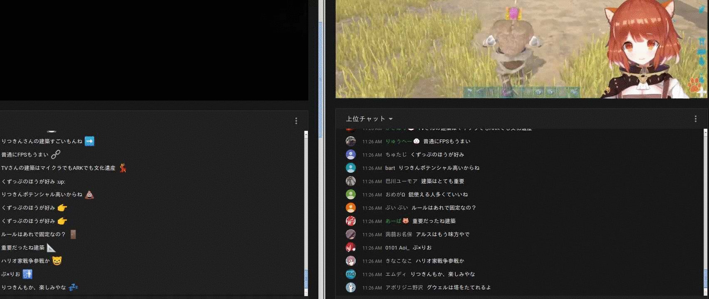
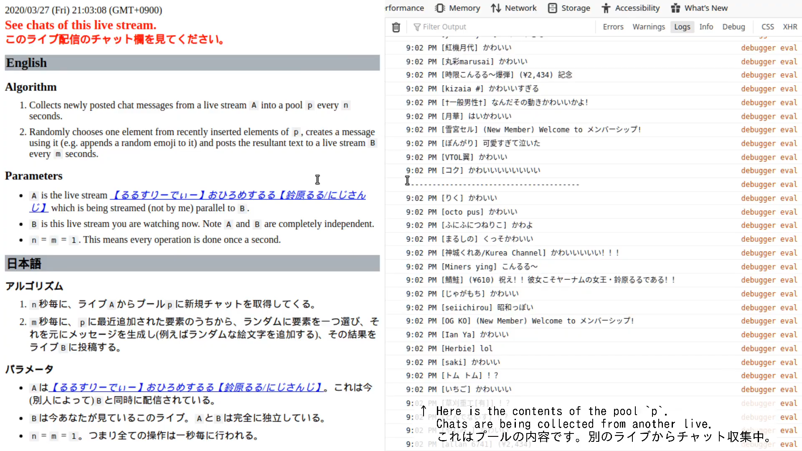

# YouTube Chat Bot

## Introduction

Recently we often observe a new type of chat bots on YouTube. They are different from traditional chat bots in that

- Messages they post do **not** contain harmful contents (e.g. URL of spam websites).

- Their icons are normally erotic and their names are usually like "See My Profile" or such.

- At first glance it seems they are not bots. This is because the messages they post are relevant to the contents of the live streams. It is said that this behavior is implemented by collecting recent chats posted by other (real) users and periodically re-posting them.

In this project, we reproduce such a chat bot.

## Caveat

This project was created for the purpose of studying chat bots. Every test is done in our private live streams. **Never use this project as a spam bot.**

## Files

**Important Notes:** Since `example.js` and `test.js` are just variants of `main.js`, only `main.js` script is actively maintained. The other two scripts may have older implementations.

### `main.js`

This script does two things asynchronously:

- To collect chats posted by other users and to store them in the pool `c` every `n` milliseconds.

- To post chats every `m` milliseconds whose contents are created using a randomly chosen element from `c`.

**Structure**

|  |
| :-- |

### `example.js`

This script initializes the pool `c` using pre-collected chats (see `chat_list.js`), randomly chooses one chat from the pool every `n` milliseconds, appends a random emoji (see `emoji_list.js`) to it and finally posts the resultant text as a chat.

**Demo**

|  |
| :-- |

### `test.js`

This script is similar to `main.js`. The only essential difference is that this script collects chats from a live stream `A` and re-posts them to another live stream `B` while `main.js` collects chats from and re-posts them to the same live stream `A`.

**Structure**

|  |
| :-- |

**Demo1**

|  |
|:--|
| Demo of `test.js`. Chats are being collected from the right window into a pool `c` once a second. At the same time, once a second, one chat is ramdomly chosen from the latest five entries in `c`, appended with a random emoji, and then re-posted to the left window (another live stream). |

**Demo2**

Recently we demonstrated how the bot works, using a live stream. Click the thumbnail below to watch the archive on YouTube. The script used in the stream was essentially the same as `test.js`.

|  |
| :-- |

### `misc/for_greasemonkey/chat_bot.user.js`

This script is just `main.js` ported for [Greasemonkey](https://www.greasespot.net/). Think hundreds times before you install this script. Disable the script unless you deeply understand what you are doing. Enable the script only when it is really needed. For and only for test purposes, you can safely use the script.

## Environments

### Supported OSes

This project is cross-platform. Every OS is supported.

### Supported Browsers

The scripts are tested on Firefox and Google Chrome.

## Usage

1. Open any live stream page.

2. Open web console of your browser.

3. Execute a script in it.

<!-- vim: set spell -->

